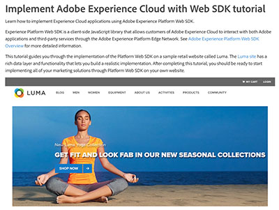
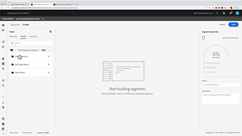
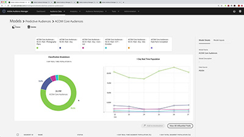

# Tutoriales de Audience Manager

Bienvenido al sitio de tutoriales de Audience Manager. El uso de estos tutoriales junto con la [documentación](https://experienceleague.adobe.com/docs/audience-manager/user-guide/aam-home.html?lang=es) le permitirá comprender mejor cómo usar Adobe Audience Manager para crear y activar audiencias en cualquier canal o dispositivo que use el mejor [!DNL data management platform] de Adobe.

* **Selección de personal** destaca algunos de nuestros contenidos favoritos
* Explore el contenido por tema y subtema en la **navegación izquierda**
* Utilice el campo **search** en la parte superior de la página si sabe lo que está buscando

## Selección de personal

<table>
<tr>
  <td>
    
    

      <a href="https://experienceleague.adobe.com/docs/platform-learn/implement-web-sdk/overview.html?lang=es">
    <strong>Implementar Adobe Experience Cloud con el tutorial de Web SDK</strong>
    </a>
    

    

    <em>Aprenda a implementar aplicaciones de Experience Cloud mediante Adobe Experience Platform Web SDK.</em>
    

  </td>
  <td>
    
    

      <a href="https://experienceleague.adobe.com/docs/audience-manager-learn/tutorials/other-integrations/integrating-with-rtcdp/rtcdp-segments-for-aam-users.html?lang=es">
    <strong>Explicación de los segmentos de CDP en tiempo real para usuarios de Audience Manager</strong>
    </a>
    

    

    <em>Este vídeo analiza las diferencias en la creación de segmentos y segmentos entre Audience Manager y Real-Time CDP.</em>
    

  </td>
  <td>
    
    

      <a href="https://experienceleague.adobe.com/docs/audience-manager-learn/tutorials/build-and-manage-audiences/algorithmic-models/configure-and-report-on-predictive-audiences.html?lang=es">
    <strong>Configurar e informar sobre Predictive Audiences en Audience Manager</strong>
    </a>
    

    

    <em>En este vídeo, se mostrará la configuración de Audiencias predictivas en la interfaz de Audience Manager.</em>
    

  </td>
</tr>
</table>

