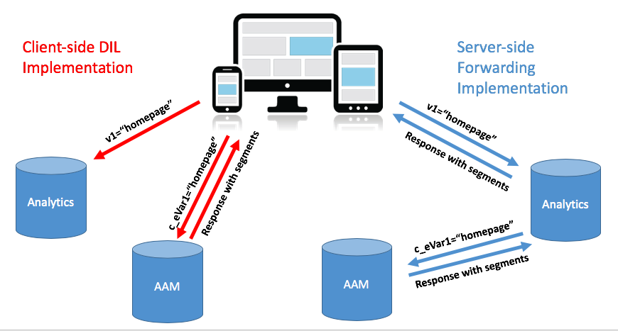
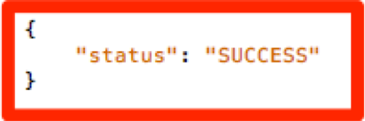

# Migre la implementación de Audience Manager de su sitio desde DIL del lado del cliente al reenvío del lado del servidor {#migrating-your-site-s-aam-implementation-from-client-side-dil-to-server-side-forwarding}

Este tutorial se aplica si tiene Adobe Audience Manager (AAM) y Adobe Analytics, y está enviando una visita de la página a AAM mediante el código DIL ([!DNL Data Integration Library]), y también enviando una visita de la página a Adobe Analytics. Dado que tiene ambas soluciones y que ambas forman parte de Adobe Experience Cloud, tiene la oportunidad de seguir la práctica recomendada de activar el reenvío del lado del servidor, que permite a los servidores de recopilación de datos de [!DNL Analytics] reenviar los datos de análisis del sitio en tiempo real a Audience Manager, en lugar de hacer que el código del lado del cliente envíe una visita adicional de la página a AAM. Este tutorial le guiará por los pasos para realizar el cambio de la implementación de DIL del lado del cliente más antigua al método de reenvío del lado del servidor más reciente.

## Lado del cliente (DIL) frente a lado del servidor {#client-side-dil-vs-server-side}

Al comparar y contrastar estos dos métodos para obtener datos de Adobe Analytics en AAM, puede resultar útil visualizar primero las diferencias en la siguiente imagen:

### Implementación de DIL del lado del cliente {#client-side-dil-implementation}

Si usa este método para obtener datos de Adobe Analytics en AAM, recibirá dos visitas provenientes de sus páginas web: una que se dirigirá a [!DNL Analytics] y otra a AAM (después de haber copiado los datos de [!DNL Analytics] en la página web). [!UICONTROL Segments] se devuelven de AAM a la página, donde se pueden usar para personalización, etc. Se considera una implementación heredada y ya no se recomienda.

Además de no seguir las prácticas recomendadas, las desventajas de utilizar este método son las siguientes:

* Dos visitas procedentes de la página en lugar de una sola
* se requiere el reenvío del lado del servidor para el uso compartido en tiempo real de audiencias de AAM con [!DNL Analytics], de modo que las implementaciones del lado del cliente no permiten esta característica (y posiblemente otras características en el futuro)

Se recomienda pasar a un método de reenvío del lado del servidor de la implementación de AAM.

### Implementación del reenvío del lado del servidor {#server-side-forwarding-implementation}

Como se muestra en la imagen anterior, una visita procede de la página web a Adobe Analytics. [!DNL Analytics] reenvía esos datos a AAM en tiempo real, y los visitantes se evalúan en características de AAM y [!UICONTROL segments], como si la visita hubiera provenido directamente de la página.

[!UICONTROL Segments] se devuelven en la misma visita en tiempo real de vuelta a [!DNL Analytics], que reenvía la respuesta en a la página web para su personalización, etc.

El paso al reenvío del lado del servidor no presenta inconvenientes temporales. Adobe recomienda encarecidamente que cualquier persona que tenga Audience Manager y [!DNL Analytics] utilice este método de implementación.

## Tiene dos tareas principales {#you-have-two-main-tasks}

Hay bastante información en esta página, y todo es importante, por supuesto. Sin embargo, **todo se reduce a dos cosas principales que debe hacer**:

1. Cambie el código del código DIL del lado del cliente al código de reenvío del lado del servidor
1. Invertir el modificador en [!DNL Analytics] [!DNL Admin Console] para iniciar el reenvío real de datos (por [!UICONTROL report suite])

Si omite cualquiera de estas tareas, el reenvío del lado del servidor no funcionará correctamente. Se han agregado pasos y datos adicionales a este documento para ayudarle a realizar estos dos pasos correctamente para su configuración.

## Opciones de implementación {#implementation-options}

A medida que pasa del lado del cliente al reenvío del lado del servidor, una de las tareas que tendrá es cambiar el código al nuevo código de reenvío del lado del servidor. Esto se realiza mediante una de las siguientes opciones:

* Etiquetas de Adobe Experience Platform: la opción de implementación recomendada por Adobe para las propiedades web. Verá que esto es una tarea fácil, ya que las etiquetas de Platform han hecho todo el trabajo duro por usted.
* En la página: también puede colocar el nuevo código SSF directamente en la función `doPlugins` dentro del archivo `appMeasurement.js`, si (aún) no está utilizando Adobe Launch
* Otros administradores de etiquetas: se pueden tratar igual que la opción anterior (en la página), ya que aún colocará el código SSF en `doPlugins`, independientemente de si el otro administrador de etiquetas almacena el código [!DNL AppMeasurement]

Observaremos cada uno de estos elementos en la sección _Actualización del código_.

## Pasos de implementación {#implementation-steps}

Los siguientes pasos describen la implementación.

### Paso 0: Requisito previo: Servicio de Experience Cloud ID (ECID) {#step-prerequisite-experience-cloud-id-service-ecid}

El requisito previo principal para pasar al reenvío del lado del servidor es tener implementado el servicio de Experience Cloud ID. Esto se hace más fácilmente si utiliza Experience Platform Launch, en cuyo caso solo tiene que instalar la extensión ECID y hará el resto.

Si usa un sistema de administración de etiquetas que no es de Adobe o no usa ningún sistema de administración de etiquetas, implemente ECID para ejecutar **antes** de cualquier otra solución de Adobe. Consulte la [documentación de ECID](https://experienceleague.adobe.com/docs/id-service/using/home.html) para obtener más información. El único otro requisito previo es con respecto a las versiones del código, por lo que al aplicar las versiones más recientes del código en los siguientes pasos, estará bien.

>[!NOTE]
>
>Lea todo este documento antes de implementar. La sección &quot;Tiempo&quot; que aparece a continuación contiene información importante sobre *cuándo* debe implementar cada parte, incluido ECID (si aún no se ha implementado).

### Paso 1: Registrar las opciones utilizadas actualmente en el código DIL {#step-record-currently-used-options-from-dil-code}

A medida que se prepara para pasar del código DIL del lado del cliente al reenvío del lado del servidor, el primer paso es identificar todo lo que está haciendo con el código DIL, incluida la configuración personalizada y los datos enviados a AAM. Los aspectos a tener en cuenta incluyen:

* Variables [!DNL Analytics] normales, con el módulo DIL `siteCatalyst.init`: no tiene que preocuparse por esta, ya que su trabajo consiste únicamente en enviar las variables [!DNL Analytics] normales, y esto sucede simplemente porque tiene habilitado el reenvío del lado del servidor.
* Subdominio de socio: en la función `DIL.create`, anote el parámetro `partner`. Esto se conoce como su &quot;subdominio de socio&quot;, o a veces &quot;ID de socio&quot;, y será necesario cuando coloque el nuevo código de reenvío del lado del servidor.
* [!DNL Visitor Service Namespace] - También conocido como su &quot;[!DNL Org ID]&quot; o &quot;[!DNL IMS Org ID]&quot;, también lo necesitará cuando configure el nuevo código de reenvío del lado del servidor. Tome nota de ello.
* containerNSID, uuidCookie y otras opciones avanzadas: tome nota de cualquier opción avanzada adicional que esté utilizando para poder establecerla también en el código de reenvío del lado del servidor.
* Variables de página adicionales: si se envían otras variables a AAM desde la página (además de las variables normales [!DNL Analytics] gestionadas por siteCatalyst.init), deberá tomar nota de ellas para que se puedan enviar mediante reenvío del lado del servidor (alerta de spoiler: a través de variables [!DNL contextData]).

### Paso 2: Actualizar el código {#step-updating-the-code}

En [Opciones de implementación](#implementation-options) (arriba) se ofrecen varias opciones con respecto a cómo y dónde se implementa el reenvío del lado del servidor. Para que esta sección sea efectiva, necesitamos dividirla en estas secciones (con dos de ellas combinadas). Vaya al método de esta sección que mejor describa sus necesidades.

#### Etiquetas Adobe Experience Platform {#launch-by-adobe}

Vea el siguiente vídeo para obtener más información sobre cómo mover las opciones de implementación del código DIL del lado del cliente al reenvío del lado del servidor en Experience Platform Launch.

>[!VIDEO](https://video.tv.adobe.com/v/26310/?quality=12)

#### Administrador de etiquetas &quot;En la página&quot; o que no sea de Adobe {#on-the-page-or-non-adobe-tag-manager}

Vea el siguiente vídeo para obtener información sobre cómo mover opciones de implementación del código DIL del lado del cliente al reenvío del lado del servidor en código [!DNL AppMeasurement], que reside en un archivo o en un sistema de administración de etiquetas que no es de Adobe.

>[!VIDEO](https://video.tv.adobe.com/v/26312/?quality=12)

### Paso 3: Habilitar el reenvío (por [!UICONTROL Report Suite]) {#step-enabling-the-forwarding-per-report-suite}

Hasta ahora, en este tutorial hemos invertido todo nuestro tiempo en cambiar el código del código de DIL del lado del cliente al reenvío del lado del servidor. Eso está bien, porque es la parte más difícil. Esta sección, aunque verá que es muy fácil, es tan importante como actualizar el código. En este vídeo, verá cómo voltear el conmutador que habilita el reenvío real de datos de Analytics a Audience Manager.

>[!VIDEO](https://video.tv.adobe.com/v/26355/?quality-12)

**NOTA:** Como se indica en el vídeo, recuerde que la activación del reenvío tardará hasta 4 horas en implementarse completamente en el servidor de Experience Cloud.

## Programación {#timing}

Como recordatorio, existen dos tareas principales para pasar de DIL del lado del cliente al reenvío del lado del servidor:

1. Actualización del código
1. Cambiando el conmutador en [!DNL Analytics] [!DNL Admin Console]

Pero la pregunta es, ¿cuál haces primero? ¿Importa? Vale, lo siento, fueron dos preguntas. Pero las respuestas son... depende, y sí, *puede* importar. ¿Cómo es eso de vago? Vamos a descomponerlo... Pero primero una pregunta adicional que puede surgir si usted es una organización grande con numerosos sitios: ¿Tengo que hacer todo a la vez? Ese es un poco más fácil. No. Puedes hacerlo pieza por pieza.

### Un poco más profundo {#a-little-deeper-dive}

La razón por la que el tiempo y el orden son importantes es por el modo en que funciona el reenvío de _realmente_, lo cual se puede resumir en los siguientes hechos técnicos:

* Si tiene implementado el Servicio de Experience Cloud ID (ECID) y el conmutador en [!DNL Analytics] [!DNL Admin Console] (&quot;el conmutador&quot;) está activado, los datos SE REENVIARÁN de [!DNL Analytics] a AAM, aunque aún no haya actualizado el código.
* Si no tiene implementado ECID, los datos no se reenviarán, aunque tenga el conmutador encendido y el código de reenvío del lado del servidor.
* El código de reenvío del lado del servidor (ya sea en etiquetas de Platform o en la página) realmente gestiona la respuesta y es necesario para completar la migración.
* Recuerde que el conmutador de reenvío del lado del servidor está habilitado por [!UICONTROL report suite], pero que el código lo gestiona la propiedad en etiquetas de Platform o el archivo [!DNL AppMeasurement] si no utiliza etiquetas de Platform.

### Prácticas recomendadas {#best-practices}

En función de estos detalles técnicos, estas son las recomendaciones para el momento de qué hacer y cuándo:

#### Si TODAVÍA NO ha implementado ECID {#if-you-do-not-have-ecid-yet-implemented}

1. Cambie el conmutador [!DNL Analytics] para cada [!UICONTROL report suite] que habilitará para el reenvío del lado del servidor.

   1. El reenvío aún no comienza porque no tiene ECID.

1. Por sitio, actualice el código de DIL del lado del cliente al reenvío del lado del servidor (puede estar en etiquetas de Platform ) o en la página, como se describe en otra sección anterior).

   1. El reenvío ahora fluye (tal como ha agregado ECID) y también debería recibir una respuesta JSON adecuada para su señalización [!DNL Analytics] (consulte la sección Validación y solución de problemas a continuación para obtener más detalles).

#### Si tiene ECID implementado {#if-you-do-have-ecid-implemented}

1. Prepare y planifique para que esté listo para actualizar su código de DIL al reenvío del lado del servidor PER [!UICONTROL report suite] que habilitará para el reenvío del lado del servidor:

   1. Cambie el conmutador [!DNL Analytics] para habilitar el reenvío del lado del servidor.

      1. El reenvío comenzará porque tiene ECID habilitado.

   1. Actualice lo antes posible el código de DIL del lado del cliente al reenvío de un solo lado (puede estar en las etiquetas de Platform o en la página, como se explica en otra sección anterior).

      1. Debe recibir una respuesta JSON adecuada a su señalización [!DNL Analytics] (consulte la sección [Validación y solución de problemas](#validation-and-troubleshooting) más abajo para obtener más detalles).

>[!NOTE]
>
>Es importante realizar estos dos pasos lo más cerca posible entre sí, ya que entre los pasos 1 y 2 anteriores, tendrá la duplicación de datos que se van a AAM. En otras palabras, el reenvío de un solo lado habrá comenzado a enviar datos de [!DNL Analytics] a AAM y, como el código de DIL sigue en la página, también se producirá una visita que irá directamente de la página a AAM, con lo que se duplicarán los datos. En cuanto actualice el código de DIL al reenvío del lado del servidor, esto se aliviará.

>[!NOTE]
>
>Si prefiere tener una pequeña discrepancia en los datos en lugar de una pequeña duplicación de datos, puede cambiar el orden de los pasos 1 y 2 anteriores. Si se mueve el código de DIL al reenvío del lado del servidor, se detendrá el flujo de datos a AAM hasta que se pueda girar el conmutador para activar el reenvío del lado del servidor para [!UICONTROL report suite]. Normalmente, los clientes prefieren duplicar ligeramente los datos en lugar de pasar por alto la introducción de visitantes en las características y [!UICONTROL segments].

#### Tiempo de migración cuando tiene muchos sitios y [!UICONTROL report suites] {#migration-timing-when-you-have-many-sites-and-report-suites}

Este tema se trata brevemente en secciones anteriores, ya que la estrategia principal se puede resumir de la siguiente manera:

Migrar un sitio/[!UICONTROL report suite] (o grupo de sitios/[!UICONTROL report suites]) a la vez.

Sin embargo, esto puede resultar un poco complicado en función de algunos escenarios posibles:

* Tiene un sitio que contiene varios [!UICONTROL report suites] distintos
* Tiene un(a) [!UICONTROL report suite] que incluye varios sitios (como un(a) [!UICONTROL report suite] global)
* Utilice una propiedad de etiquetas de Platform para cubrir varios sitios
* Tiene diferentes equipos de desarrollo para diferentes sitios

Debido a estos artículos, puede ser un poco complicado. Las mejores cosas que puedo sugerir son:

* Dedique algún tiempo a crear una estrategia para migrar al reenvío del lado del servidor, en función de los aspectos explicados anteriormente
* Teniendo en cuenta que una sola propiedad en etiquetas de Platform (o un solo archivo de [!DNL AppMeasurement]) suele asignarse a 1 o 2 [!UICONTROL report suites] distintos, probablemente podrá realizar un plan que funcione en estos grupos distintos uno por uno, actualizando la empresa al reenvío del lado del servidor
* Si está trabajando con Adobe Consulting, hable con ellos acerca de su plan de migración para que puedan ayudarle según sea necesario

## Validación y solución de problemas {#validation-and-troubleshooting}

La manera principal de comprobar que el reenvío del lado del servidor funciona es consultar la respuesta a cualquiera de sus visitas de Adobe Analytics que llegan desde la aplicación.

Si no reenvía datos del lado del servidor de [!DNL Analytics] a Audience Manager, no hay respuesta a la señalización [!DNL Analytics] (más allá de un píxel 2x2). Sin embargo, si está reenviando el lado del servidor, puede comprobar ciertos elementos en la solicitud y la respuesta de [!DNL Analytics] que le permiten saber que [!DNL Analytics] se está comunicando correctamente con Audience Manager, reenviando la visita y obteniendo una respuesta.

>[!VIDEO](https://video.tv.adobe.com/v/26359/?quality=12)

>[!WARNING]
>
>Tenga en cuenta los falsos &quot;Success&quot;. Si hay una respuesta y todo parece funcionar, asegúrese de que tiene el objeto `stuff` en la respuesta. Si no lo hace, puede que vea un mensaje que dice `"status":"SUCCESS"`. Por muy loco que suene, esto es en realidad la prueba de que NO está funcionando correctamente.
>
>Si lo ve, significa que ha completado la actualización de código en las etiquetas de Platform o [!DNL AppMeasurement], pero que el reenvío en [!DNL Analytics] [!DNL Admin Console] aún no ha finalizado. En este caso, debe comprobar que ha habilitado el reenvío del lado del servidor en [!DNL Analytics] [!DNL Admin Console] para su [!UICONTROL report suite]. Si lo ha hecho y aún no han pasado cuatro horas, tenga paciencia, ya que puede tardar tanto en realizar todos los cambios necesarios en el servidor.

Para obtener más información acerca del reenvío del lado del servidor, consulte la [documentación](https://experienceleague.adobe.com/docs/analytics/admin/admin-tools/server-side-forwarding/ssf.html).
