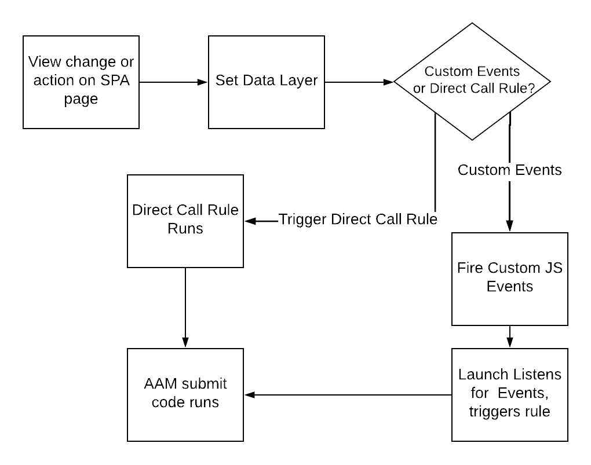

# Prácticas recomendadas en páginas de SPA al enviar datos a AAM {#using-best-practices-on-spa-pages-when-sending-data-to-aam}

En este documento se describen varias prácticas recomendadas para enviar datos de aplicaciones de una sola página (SPA) a Adobe Audience Manager (AAM). Este artículo se centra en el uso de [!UICONTROL Experience Platform tags], el método de implementación recomendado.

## Notas iniciales

* Los elementos siguientes asumirán que está utilizando etiquetas de Platform para implementar en el sitio. Las consideraciones siguen existiendo si no utiliza etiquetas de Platform, pero deberá adaptarlas al método de implementación.
* Todos los SPA son diferentes, por lo que es posible que tenga que modificar algunos de los siguientes elementos para adaptarlos a sus necesidades, pero Adobe desea compartir algunas prácticas recomendadas que debe tener en cuenta a medida que envía datos de páginas SPA a Audience Manager.

## Diagrama sencillo del trabajo con SPA y AAM en etiquetas de Experience Platform (anteriormente, Launch){#simple-diagram-of-working-with-spas-and-aam-in-experience-platform-launch}

>[!NOTE]
>Como se ha indicado, este es un diagrama simplificado de cómo se gestionan las páginas de SPA en una implementación de Adobe Audience Manager (sin Adobe Analytics) mediante etiquetas de Platform. Como puede ver, es bastante sencillo, y la gran decisión es cómo va a comunicar un cambio de vista (o una acción) a las etiquetas de Platform.

## Activación de etiquetas desde la página de SPA {#triggering-launch-from-the-spa-page}

Dos de los métodos más comunes para activar una regla en las etiquetas de Platform (y, por lo tanto, enviar datos a Audience Manager) son:

* Estableciendo eventos personalizados de JavaScript (vea el ejemplo [AQUÍ](https://helpx.adobe.com/analytics/kt/using/spa-analytics-best-practices-feature-video-use.html) con Adobe Analytics)
* Usando un(a) [!UICONTROL Direct Call Rule]

En este ejemplo de Audience Manager, utiliza un [!UICONTROL Direct Call rule] en las etiquetas de Platform para almacenar en déclencheur la visita que va a Audience Manager. Como verá en las secciones siguientes, esto resulta útil al establecer [!UICONTROL Data Layer] en un nuevo valor, de modo que [!UICONTROL Data Element] pueda recogerlo en las etiquetas de Platform.

## Página de demostración {#demo-page}

Esta es una pequeña página que muestra cómo cambiar un valor en la capa de datos y enviarlo a Audience Manager, como puede hacer en una página de SPA. Esta funcionalidad se puede modelar para realizar cambios más elaborados. Puede encontrar esta página de demostración [AQUÍ](https://aam.enablementadobe.com/SPA-Launch.html).

## Configuración de la capa de datos {#setting-the-data-layer}

Como se ha mencionado anteriormente, cuando se carga contenido nuevo en la página o cuando alguien realiza una acción en el sitio, la capa de datos debe configurarse dinámicamente en el encabezado de la página ANTES de llamar a las etiquetas de Platform y ejecutar [!UICONTROL rules], de modo que las etiquetas de Platform puedan recoger los nuevos valores de la capa de datos e insertarlos en Audience Manager.

Si va al sitio de demostración mencionado anteriormente y mira el origen de la página, verá lo siguiente:

* La capa de datos se encuentra en el encabezado de la página, antes de la llamada a las etiquetas de Platform
* El JavaScript del vínculo de la SPA simulado cambia [!UICONTROL Data Layer] y, a continuación, llama a las etiquetas de Platform (la llamada `_satellite.track()`). Si utilizaba eventos personalizados de JavaScript en lugar de este(a) [!UICONTROL Direct Call Rule], la lección es la misma. Primero cambie [!DNL data layer] y luego llame a las etiquetas de Platform.

>[!VIDEO](https://video.tv.adobe.com/v/38110/?captions=spa&quality=12)

## Recursos adicionales {#additional-resources}

* [Debate de SPA en los foros de Adobe](https://forums.adobe.com/thread/2451022)
* [Sitios de arquitectura de referencia para mostrar cómo implementar SPA en etiquetas de Platform](https://helpx.adobe.com/experience-manager/kt/integration/using/launch-reference-architecture-SPA-tutorial-implement.html)
* [Uso de las prácticas recomendadas al rastrear SPA en Adobe Analytics](https://helpx.adobe.com/analytics/kt/using/spa-analytics-best-practices-feature-video-use.html)
* [Sitio de demostración utilizado para este artículo](https://aam.enablementadobe.com/SPA-Launch.html)
